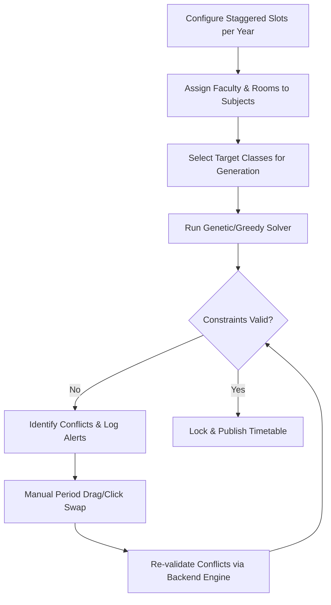

# Timetable Scheduler & Manager

An Automated College Timetable Management System built to streamline academic scheduling. The application handles complex constraints, allows staggered year-wise slot configurations, supports drag/click swapping with real-time collision checking, and implements multi-role control (Admin vs. Department Users).

---

## 🛠️ Architecture & Tech Stack

The project is split into a client-server architecture:

- **Backend**: Node.js, Express.js, MongoDB (Mongoose ODM).
  - Custom scheduling algorithm engine in `backend/engine/scheduler.js`.
  - Staggered slots, constraint checking, and multi-department separation.
- **Frontend**: React, Vite, Vanilla CSS.
  - Component-driven UI with sleek animations, interactive timetable grid, drag-and-drop/click swap workflows, and searchable elements.

---

## 📊 Database Relationship Model (ERD)

The following Mermaid diagram outlines the entity relationships within the MongoDB database:

```mermaid
erDiagram
    DEPARTMENT ||--o{ CLASS : "owns"
    DEPARTMENT ||--o{ FACULTY : "employs"
    DEPARTMENT ||--o{ SUBJECT : "offers"
    DEPARTMENT ||--o{ TIMETABLE : "generates"
    
    CLASS ||--o| ROOM : "has default classroom"
    CLASS ||--o| FACULTY : "has advisor"
    CLASS ||--o{ TIMETABLE_ENTRY : "schedules"
    
    SUBJECT ||--o| ROOM : "pre-assigns lab"
    
    FACULTY_SUBJECT_MAPPING }|--|| FACULTY : "assigns"
    FACULTY_SUBJECT_MAPPING }|--|| SUBJECT : "requires"
    FACULTY_SUBJECT_MAPPING }|--|| CLASS : "attaches to"
    
    TIMETABLE ||--o{ TIMETABLE_ENTRY : "contains"
```

---

## 🔄 System Scheduling Workflow

The process from configuration to final timetable publishing involves several distinct stages:



---

## 🧮 Advanced Scheduling Logic & Constraints Engine

At the core of this system is the scheduling algorithm located in [scheduler.js](backend/engine/scheduler.js). It differs from typical block-grid schedulers by supporting **staggered time slot schedules**—different classes and semesters can have custom start and end period offsets.

### Core Constraint Rules
1. **Time-Based Collision Checking**: Rather than matching static grid slot indices, the engine converts time strings to absolute minutes (`timeStrMins(hh:mm)`) and performs intersection checks (`checkTimeOverlap`). This ensures that staggered year-wise lunch breaks or shifted class timings do not result in double-booking of shared faculty or laboratories.
2. **Faculty Consecutive Limit Rules**: A single faculty member cannot be scheduled to teach different subjects back-to-back within a defined threshold gap (e.g., `< 40 mins`), reducing fatigue. However, consecutive sessions of the *same* subject (e.g., a 2-hour practical Lab session) are permitted.
3. **Room Availability Verification**: Rooms (especially specialized Labs) are reserved globally across all departments. The engine checks overlap arrays across classes to prevent two classes from accessing the same Lab simultaneously.
4. **Subject Type Allocation Priorities**: Schedulers solve requirements sequentially based on a strict priority model:
   $$\text{Lab Practical (1)} \rightarrow \text{Projects (2)} \rightarrow \text{Theory / Electives (3)} \rightarrow \text{Non-Academic Activities (4)}$$

---

## 🚀 Key Features

- **Automated Generation Wizard**: Auto-generates timetables while respecting complex constraints (faculty busy slots, laboratory assignments, classroom capacities).
- **Interactive Timetable Grid & Swap Mode**: Easily rearrange schedules. Clicking on a slot enters **Swap Mode**, which highlights potential conflict-free slots in a distinct orange visual accent and validates collisions using the backend constraints validator.
- **Multi-Role Scoping**:
  - **Admin**: Has institutional control. Can add/edit/delete records for all departments, configure settings, and filter/view timetables by department.
  - **Department User**: Scoped strictly to their own department (e.g., CSE, ECE) for editing, but can view other departments' schedules.
- **Staggered Slot Configurations**: Configure active classes, break periods, and lunch periods on a year-by-year basis.
- **Import/Export Utility**: Import subjects and faculty details quickly using Excel spreadsheets (.xlsx, .xls) and CSV templates.
- **Audit Logging**: Fully registers administrative actions for traceability and error-checking.

---

## 💻 Installation & Setup

### Prerequisites
- [Node.js](https://nodejs.org/) (v18+ recommended)
- [MongoDB](https://www.mongodb.com/try/download/community) (running locally or a MongoDB Atlas URI)

> [!IMPORTANT]
> Ensure MongoDB is running on your environment before launching the backend, as it is required to seed default departments, administrators, and default settings.

---

### 1. Backend Setup

1. Navigate to the `backend` directory:
   ```bash
   cd backend
   ```

2. Install dependencies:
   ```bash
   npm install
   ```

3. Configure Environment Variables:
   Create a `.env` file in the `backend` directory (a fallback is automatically used if left blank):
   ```env
   MONGODB_URI=mongodb://localhost:27017/timetable_db
   PORT=5050
   ```

4. Run the Backend:
   - For development (with auto-reload):
     ```bash
     npm run dev
     ```
   - For production:
     ```bash
     npm start
     ```

### 2. Frontend Setup

1. Navigate to the `frontend` directory:
   ```bash
   cd ../frontend
   ```

2. Install dependencies:
   ```bash
   npm install
   ```

3. Run the Frontend:
   - For development:
     ```bash
     npm run dev
     ```
   - Build for production:
     ```bash
     npm run build
     ```

> [!TIP]
> The frontend API base URL is configured in [api.js](frontend/src/utils/api.js) and defaults to `http://localhost:5050/api`. If you deploy the backend on a different port, update the `baseURL` inside this file.

---

## 📂 Project Directory Structure

```text
├── backend/
│   ├── engine/           # Scheduling & Swap validation algorithms
│   ├── middleware/       # JWT Token authentication & role protection
│   ├── models/           # Mongoose schemas (User, Class, Subject, Room, etc.)
│   ├── routes/           # Express endpoint controllers
│   ├── db.js             # MongoDB connection setup
│   └── server.js         # Entry point & DB seed routines
│
├── frontend/
│   ├── src/
│   │   ├── components/   # Reusable UI elements (Modal, Toast, SearchableSelect)
│   │   ├── context/      # React AuthContext provider
│   │   ├── pages/        # Views (TimetableView, Classes, Subjects, Faculty, etc.)
│   │   └── utils/        # Axios API configurations
│   ├── index.html        # Entry index
│   └── vite.config.js    # Vite configuration
│
└── README.md             # Project documentation
```
